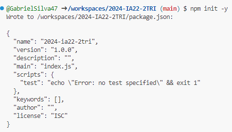
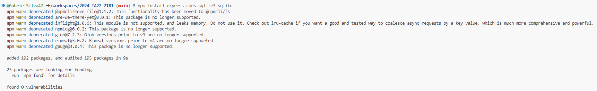
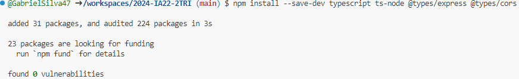
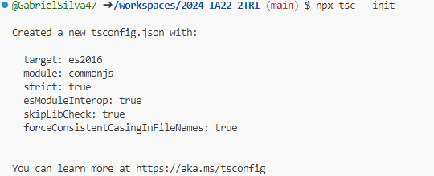
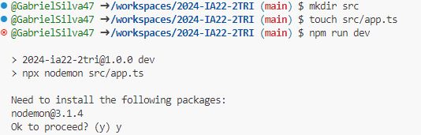
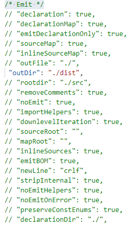
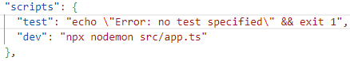

# 2024-IA22-2TRI

# **Iniciando um projeto Node.js com TypeScript** #

### Abra o seu github, crie um repositorio feito isso abra o codespaces. Abra o terminal e escreva o código abaixo. ###

```

npm init -y

npm install express cors sqlite3 sqlite

npm install --save-dev typescript nodemon ts-node @types/express @types/cors

npx tsc --init

mkdir src

touch src/app.ts

````

# Escreva um de cada vez. Aparecerá isso  #

``´´Imagem do init -y:´´``



``´´Imagem do install express cors sqlite3 sqlite:´´``

  

``´´Imagem do install --save-dev typescript nodemon ts-node @types/express @types/cors:´´``



``´´Imagem do tsc --init:´´``



``´´Imagem do src/app.ts:´´``



# **Configuranado o tsconfig.json** #

###  Va no tsconfig.json procure /* Emit */ e altere as linhas "//outDir": "./", para ``"outDir": "./dist"``, e adicione a linha "//rootDir": "./src", o ficara desta maneira.  ###



# **Configurando o package.json** #

### Va no package.json preocure por script nele você adicionara a seguinte linha ###

````

 "dev": "npx nodemon src/app.ts"

````

### o código ficara da seguinte maneira. ###

 

# **Criando arquivo inicial do servidor** #

### Vá na pasta ``src`` crie uma novo arquivo com o ``database.ts``dentro dele coloque o seginte código: ###

```typescript
import express from 'express';
import cors from 'cors';

const port = 3333;
const app = express();

app.use(cors());
app.use(express.json());

app.get('/', (req, res) => {
  res.send('Hello World');
});

app.listen(port, () => {
  console.log(`Server running on port ${port}`); 
}); 
```

# Inicializando o servidor #

Vá no terminal novamenete e escreva isso: 

````

npm run dev

````

Se tudo der certo aparecerá isso no terminal

````

Server running on port 3333

````